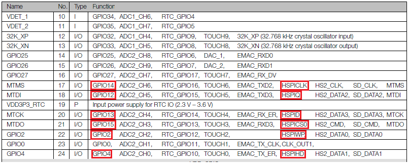
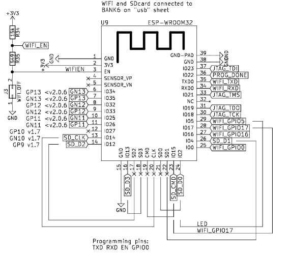

# Using VisualMicro to Program the ULX3S ESP32 Display

The ULX3S has both onboard FPGA and the Espressif ESP32. One of the ways to program the ESP32 is using the Arduino IDE.
Another, and considerably more productive method - is to use Visual Micro.

VisualMicro is a Visual Studio extension that makes programming the ESP32 (and any other device the Arduino IDE uses)
vastly easier and more powerful. All the benefits of GitHub integration, auto-complete, syntax highlighting, serial debugging, and more
are available to the ESP32 developer when using Visual Micro.

There's also a [Verilog Syntax Highlighter](https://marketplace.visualstudio.com/items?itemName=gojimmypi.gojimmypi-verilog-language-extension) 
with source code on GitHub [gojimmypi/VerilogLanguageExtension](https://github.com/gojimmypi/VerilogLanguageExtension) that can be 
helpful when editing ULX3S FPGA code in Visual Studio. 

## Quick Start

First, ensure the [FPGA passthru](../passthru/README.md) is enabled. 
Next, install [Visual Micro](../VisualMicro/README.md), 
the [Adafruit GFX](https://github.com/adafruit/Adafruit-GFX-Library) 
and [SSD1331](https://github.com/adafruit/Adafruit-SSD1331-OLED-Driver-Library-for-Arduino) libraries, 
then open the `VisualMicro-SSD1331-Display.sln` solution file in Visual Studio.
Select the COM port for your ULX3S and press F5.

```
cd %USERPROFILE%\Documents\Arduino\libraries\

# Adafruit_GFX
git clone https://github.com/adafruit/Adafruit-GFX-Library.git

# Adafruit_SSD1331
git clone https://github.com/adafruit/Adafruit-SSD1331-OLED-Driver-Library-for-Arduino.git

```

The pins used to control the ULX3S SSD-1331 display from the ESP32:

```
#define oled_csn  17 // aka cs - chip select
#define oled_dc   16 // aka ds aka a0 -  SPI data or command selector pin
#define oled_resn 25 // aka rst - reset
#define oled_mosi 15 // aka mosi - data TODO Note spec shows MOSI = GPIO13 not 15 and CS0 = GPIO15??
#define oled_clk  14 // aka sclk - clock
#define oled_miso -1 // 12 not used
```

## SSD1331 Display

The ULX3S board has a connector near the center of the board for an optional display:


From the [schematic](../doc/schematics.pdf), these are the connector names defined for the display:


If your ULX3S does not have a display you can [buy one from Amazon](https://www.amazon.com/dp/B0711RKXB5/). 
It is always good to support Adafruit, particularly given the amount of work put into their open source libraries, including ones used in this project.
Adafruit has a [OLED SSD-1331](https://www.adafruit.com/product/684) - but note that board appears to have a different size/pinout and includes a MicroSD card. ymmv.

See also the [pdf specification for the SSD-1331 Display](../doc/SSD1331_1.2.pdf) in the [doc](../doc/) folder,
as well as the [oled info](https://github.com/emard/ulx3s/blob/master/doc/MANUAL.md#oled) in [emard's ULX3S manual](https://github.com/emard/ulx3s/blob/master/doc/MANUAL.md).

## SPI

The SSD-1331 uses SPI. Here's an excellent illustration of SPI from [electronics.stackexchange](https://electronics.stackexchange.com/questions/55960/difference-between-miso-mosi-and-txd-rxd/55968#55968):


See also the [Arduino SPI Reference](https://www.arduino.cc/en/Reference/SPI).

## ULX3S ESP-32

The ULX3S on-board ESP32 is this [ESP-WROOM-32 from Mouser Electronics](https://hr.mouser.com/ProductDetail/Espressif-Systems/ESP-WROOM-32-16MB?qs=sGAEpiMZZMsRr7brxAGoXSSUPDSAjAiV1M6iRPUJ5tDjstOHDp9d7Q%3d%3d),
(Specfically the ESP32-D0WDQ6).
See also the [ESP-WROOM-32 data sheet](../doc/esp32-wroom-32_datasheet_en-1510934.pdf) and [Espressif ESP32 Series Datasheet](../doc/esp32_datasheet_en.pdf) copy in the local [doc](../doc/) folder.

# Other boards using the ESP-WROOM-32

It can be helpful to have a stand-alone WROOM-32 and SPI display, particularly when concurrently developing FPGA solutions on the ULX3S.

Here are the connections:


When programming the WROOM-32 ESP32 on something _other_ than the ULX3S, such as the stand-alone NodeMCU-32S, programming
upload errors may occur:

```
Uploading 'VisualMicro-SSD1331-Display' to 'ESP32 Dev Module' using 'COM3'
Uploader started for board ESP32 Dev Module
Upload method will be: bootloader
Uploading via Bootloader 
C:\Users\gojimmypi\AppData\Local\arduino15\packages\esp32\tools\esptool_py\2.6.0\esptool.exe --chip esp32 --port "COM3" --baud 115200 --before default_reset --after hard_reset write_flash -z --flash_mode dio --flash_freq 80m --flash_size detect 0xe000 "C:\Users\gojimmypi\AppData\Local\arduino15\packages\esp32\hardware\esp32\1.0.1/tools/partitions/boot_app0.bin" 0x1000 "C:\Users\gojimmypi\AppData\Local\arduino15\packages\esp32\hardware\esp32\1.0.1/tools/sdk/bin/bootloader_dio_80m.bin" 0x10000 "C:\Users\GOJIMM~1\AppData\Local\Temp\VMBuilds\VISUAL~2\ESP32_~1\Release/VisualMicro-SSD1331-Display.ino.bin" 0x8000 "C:\Users\GOJIMM~1\AppData\Local\Temp\VMBuilds\VISUAL~2\ESP32_~1\Release/VisualMicro-SSD1331-Display.ino.partitions.bin"
esptool.py v2.6-beta1
Serial port COM3
Connecting........_____....._____....._____....._____....._____....._____....._____
A fatal error occurred: Failed to connect to ESP32: Timed out waiting for packet header
esptool.py v2.6-beta1
```
As noted in [arduino-esp32 issue #333](https://github.com/espressif/arduino-esp32/issues/333), there are sometimes
issues with code upload on the ESP32 (but _not_ for the ULX3S). 

For the NodeMCU-32S board:

1. Press and hold `EN`
2. Press `IO0` while still holding `EN` 
3. Release `EN` while still holding `IO0` 
4. Release `IO0` (programming may resume even if `IO0` is still being held)


NOTE: The ULX3S has robust upload logic; the button pressing is *not* needed to upload code to the ESP32 on the ULX3S.

## ESP32 SPI **

IOMUX pins for SPI controllers are as below (GPIO numbers):

| Pin Name | HSPI | VSPI |
| -------- | ---- | ---- |
| CS0*     | 15   | 5    |
| SCLK     | 14   | 18   |
| MISO     | 12   | 19   |
| MOSI     | 13   | 23   |
| QUADWP   | 2    | 22   |
| QUADHD   | 4    | 21   |

note * Only the first device attaching to the bus can use CS0 pin.

** from the [ESP-IDF Programming Guide: SPI Master driver](https://docs.espressif.com/projects/esp-idf/en/latest/api-reference/peripherals/spi_master.html#gpio-matrix-and-iomux)

From the ESP32 Datasheet V3.0 (page 8)


See also a copy of the comprehensive [ESP32 IO_MUX Pins](../images/ESP32-IO_MUX.png) from Page 50 of the [Espressif ESP32 Series Datasheet](../doc/esp32_datasheet_en.pdf). 

## Passthru FPGA Needed

The FPGA sits between the display and the ESP32, allowing either the FPGA or ESP32 to control the SSD-1331 display. An FPGA design is needed to "wire" the
connection between the ESP32 to allow that device to control the display. Keep this in mind if also writing something in FPGA that also attempts to
control the display concurrently. 

The default for `ujprog` is to program to volatile SRAM (power cycle to revert). See the `-j` parameter to make FPGA changes persistent. 

### Quick Start Passthru

Windows tip: you can open a command prompt by rick-clicking on the project in Visual Studio, select `Open Folder in File Explorer`, then type `cmd` in the address path and press `enter`.
```
:: From this project directory (e.g. c:\workspace\ulx3s-examples\VisualMicro-SSD1331-Display )
cd ..\bin
ujprog.exe passthru_implementation_12F.bit
```

### SSD1331 to ESP32 Passthru via FPGA details

The ULX3S will typically ship with the passthru code already loaded on the FPGA. So this step may not always be needed.

As noted in other ULX3S ESP32 projects such as the [Getting Started with Visual Micro](../VisualMicro/README.md), 
the ESP32 sits behind the FPGA chip:



Although this allows for maximum flexibility, it also results in some additional complexity in that the FPGA chip needs to be configured
to "allow" the ESP32 to control the SSD1331 SPI display (as opposed to say, the FPGA using thg display). The [passthru](../passthru/README.md) 
FPGA project connects not only some of ESP32 pins to the physical ULX3S external pins, but also connects the ESP32 to the SPI 
connector for the SSD1331 display.

Of particular interest, are these lines from the 
[WiFi passthrough](https://github.com/emard/ulx3s-passthru/blob/71ce18953f84ea8ee07bb42d42ddc5a2673623c3/rtl/ulx3s_v20_passthru_wifi.vhd#L116) example:

```
S_oled_csn <= wifi_gpio17;
oled_csn   <= S_oled_csn;
oled_clk   <= sd_clk; --wifi_gpio14
oled_mosi  <= sd_cmd; --wifi_gpio15 aka SDA
oled_dc    <= wifi_gpio16;
oled_resn  <= gp(11); --wifi_gpio25
```

And these FPGA pin definitions:
```
// see ULX3S Contraint File for SSD1331
// N2 - OLED_CS
// P1 - OLED_DC
// P2 - OLED_RES
// P3 - OLED_MOSI // Note sd_cmd which is hard wired to GPIO15 on WROOM32 pin 23
// P4 - OLED_CLK  // Note sd_clk which is hard wired to GPIO14 on WROOM32 pin 13
```

Specifically from the [constraint file](../doc/constraints/ulx3s_v20.lpf#L72) (listed in physical board-connection order):
```
LOCATE COMP "oled_csn"  SITE "N2";
LOCATE COMP "oled_dc"   SITE "P1";
LOCATE COMP "oled_resn" SITE "P2";
LOCATE COMP "oled_mosi" SITE "P3";
LOCATE COMP "oled_clk"  SITE "P4";

IOBUF PORT "oled_csn"  PULLMODE=UP IO_TYPE=LVCMOS33 DRIVE=4;
IOBUF PORT "oled_dc"   PULLMODE=UP IO_TYPE=LVCMOS33 DRIVE=4;
IOBUF PORT "oled_resn" PULLMODE=UP IO_TYPE=LVCMOS33 DRIVE=4;
IOBUF PORT "oled_mosi" PULLMODE=UP IO_TYPE=LVCMOS33 DRIVE=4;
IOBUF PORT "oled_clk"  PULLMODE=UP IO_TYPE=LVCMOS33 DRIVE=4;
```

the above FPGA connectioned need to be "wired" in FPGA to connect to these constraint items:
```
LOCATE COMP "wifi_gpio17" SITE "N3"; # Serial1 TX
LOCATE COMP "wifi_gpio16" SITE "L1"; # Serial1 RX
LOCATE COMP "gn[11]"      SITE "E3"; # J1_31- GN11 DIFF WIFI_GPIO25
LOCATE COMP "sd_cmd"      SITE "J1"; # sd_cmd_di (MOSI) WiFi GPIO15
LOCATE COMP "sd_clk"      SITE "H2"; # sd_clk WiFi_GPIO14
```

From the FPGA code, the intent of the passthru for the display is to connect these "wires":

* N2 to N3 for oled_csn /CS  to wifi_gpio17 (GPIO17)
* P1 to L1 for oled_dc  /DC  to wifi_gpio16 (GPIO16)
* P2 to E3 for oled_resn/RES to wifi_gpio25 (GPIO25) 
* P3 to J1 for oled_mosi/SDA to sd_cmd      (GPIO15)  TODO - HSPI uses GPIO13 here
* P4 to H2 for oled_clk /SCL to sd_clk      (GPIO14)

## Pull-up needed

Note that although the contraint file seems to indicate that there's a built-in pull-up with the `PULLMODE=UP`, 
the code on the ESP32 still needs to explicitly assign the `pinMode` to each of the SPI connections with 
the `INPUT_PULLUP`, or the display will not work properly:

```
	// some C / Arduino code for display init
	#define oled_csn  17
	#define oled_dc   16
	#define oled_resn 25
	#define oled_mosi 15
	#define oled_clk  14

	// explicit pullup defintion is essential 
	pinMode(oled_csn,  INPUT_PULLUP); // pullup SPI
	pinMode(oled_dc,   INPUT_PULLUP); // pullup SPI
	pinMode(oled_resn, INPUT_PULLUP); // pullup SPI
	pinMode(oled_mosi, INPUT_PULLUP); // pullup SPI shared with SD
	pinMode(oled_clk,  INPUT_PULLUP); // pullup SPI shared with SD
```
TODO: is `INPUT_PULLUP` really needed for _output_ pins?

## Arduino Libraries Needed

Two libraries can be used to vastly simplify the use of the display with Visual Micro or the Arduinio IDE for the ESP32:

* [Adafruit_GFX](https://github.com/adafruit/Adafruit-GFX-Library) 
* [Adafruit_SSD1331](https://github.com/adafruit/Adafruit-SSD1331-OLED-Driver-Library-for-Arduino)

These can be either installed manually from GitHub, or from the Arduino IDE. Note that when updating libraries, if
any unexpected compile-time errors occur, ensure that the _latest_ libraries are _all_ updated. For Visual Micro
projects, click on `Extensions - vMicro - Visual Micro Explorer` and click `refresh`.


### Windows Arduino Libraries from GitHub for the first time

```
c:
cd %USERPROFILE%\documents\Arduino\libraries
git clone https://github.com/adafruit/Adafruit-GFX-Library
git clone https://github.com/adafruit/Adafruit-SSD1331-OLED-Driver-Library-for-Arduino
```

### Windows Arduino Libraries on Windows from GitHub - updates

```
c:
cd %USERPROFILE%\documents\Arduino\libraries
cd Adafruit-GFX-Library
git fetch
fit pull

cd %USERPROFILE%\documents\Arduino\libraries
cd Adafruit-SSD1331-OLED-Driver-Library-for-Arduino
git fetch
fit pull
```

### Windows Arduino IDE Libraries 

Ensure the [ESP32 Board](https://github.com/espressif/arduino-esp32/blob/master/docs/arduino-ide/boards_manager.md) is installed. 
This line may need to be added to the _Additional Board Manager URLs_ field:

`https://dl.espressif.com/dl/package_esp32_index.json`

To install libraries from the Arduino IDE, click `Sketch - Include Library - Manage Libraries`:


Install [Adafruit_GFX](https://github.com/adafruit/Adafruit-GFX-Library) 


                                                 
Install [Adafruit_SSD1331](https://github.com/adafruit/Adafruit-SSD1331-OLED-Driver-Library-for-Arduino)


            
## Some SPI Tips, Notes, and other Development Gems

Here are some helpful SPI tidbits from various sources:

### SPI Connection Tips
(copied [from SSD_13XX library notes](https://github.com/sumotoy/SSD_13XX/blob/master/README.md) with thanks and credits to [@sumotoy](https://github.com/sumotoy) for this section)

> <b>Connections:</b><br>
> Of course some oled has just SPI exposed but some can be configured for parallel, I2C and so on. I'm using ONLY SPI here (so don't ask for any other protocol please).<br>
> - RST Connect to +3v3 using a 4k7->10k resistor.
> - scl, sclk -> SCLK
> - sda, sdin -> MOSI
> - DC,RS ->DC pin on MCU
> - some oled has WR, RD. Leave floating...
> - some oled has D0...D7. Most of the times D0 and D1 are used for SPI, connect D2...D7 to GND or will be unstable!
> - VIN. Most oled support 5v, internally they have regulators, but follow specifications of your particular oled!
> - 3v3. This is 99% of the times an OUT! So do not use it.<br>
> 
> <b>Some notes, please read this, will save your time:</b><br>
> - Even if your OLED can work at 5V, it cannot accept logic levels at 5V!!! All OLED accept logic levels at 3v3 so if you plan to use an AVR (like UNO) you need a level converted (like CD4050 or HCF4050 powered at 3v3, very cheap).
> - Do not use logic converters based on mosfet or similar or bidirectional ones (Adafruit and Sparkfun sell a lot of these), they are crap, waveforms are distorted and DO NOT USE PARTITION RESISTOR's for that, it's a bad idea, you can damage oled and cpu in the same time.
> - Most of you know already this but remember that Arduino UNO or similar can provide 3v3 but the logic levels are always at 5V!!!
> - The RST pin is not strictly necessary but if not used must pullup to 3v3, never leave float! When is necessary? When you develop a library for example but if you change libraries you may need a complete power cycle if you are not using this pin.
> - ESP8266 has very weak SPI, should be 3v3 but most of the times is much less so better avoid use any logic chip between it and oled, I spend days around a circuit before discovering this.
> - On ESP8266, from April 2016 the pin GPIO16 misteriously doesn't works as CS, don't ask me why. I'm currently using GPIO2 or GPIO4.
> - Since I'm using the fast SPI possible, keep wires short and remember to provide a decoupling capacitor for your oled.<br>
> - If you plan to use SPI for other devices as well it's a good idea pullup the CS with a 10K resistor to +3v3, this will keep oled disabled until your CPU access it for initialization and avoid interferences.
> - It's always a good idea provide a pullup for each CS if multiple SPI devices are used, when CPU start all devices are forced disabled and CPU is able to access one by one and initialize all of them correctly, keep in mind and you will happy in the future!<br>

### Hardware SPI can be slower on the ESP32
(copied from [espressif/arduino-esp32/issues/149](https://github.com/espressif/arduino-esp32/issues/149#issuecomment-275633601) with thanks and credit to [@me-no-dev](https://github.com/me-no-dev) )

> Here is the thing about SPI and all other drivers running on ESP32:
> 
> * We have 2 cores, so there is the possibility that hardware could be accessed from both cores at the same time
> * In order to prevent that, we use mutexes
> * Locking and unlocking mutexes takes time :(
> 
> Now the ESP32 on other hand can transfer lots of data with just one lock/unlock, but that is not something that Arduino has on lower platforms (AVR), so libraries use the byte-by-byte approach to communicate, which in turn means lock/unlock every byte. And that is what causes the slowdown you see.
> 
> There are generally two ways to speed things up:
> 
> * Update all libraries to use proper multi-byte api on ESP32 (Espressif is rolling out own ILI9341 driver based on Adafruit's API)
> * Disable hardware locking by adding `#define CONFIG_DISABLE_HAL_LOCKS 1` to [esp32-hal.h](https://github.com/espressif/arduino-esp32/blob/master/cores/esp32/esp32-hal.h)

### QIO DIO QOUT DOUT flash modes
(copied from [esp32 forum](https://www.esp32.com/viewtopic.php?t=1250)

> Not all chips support all of these modes. The datasheet is the best source to know what supports what.
> * DIO - SPI host uses the "Dual I/O Fast Read" command (BBh). Two SPI pins are used to write the flash address part of the command, and to read flash data out. Therefore these phases need half the clock cycles compared to standard SPI.
> * DOUT - SPI host uses the "Dual Output Fast Read" command (3Bh). Two SPI pins are used to read flash data out. Slightly slower than DIO, because the address is written via the single MOSI data pin.
> * QIO - SPI host uses the "Quad I/O Fast Read" command (EBh). Four SPI pins are used to write the flash address part of the command, and to read flash data out. Therefore these phases need a quarter the clock cycles compared to standard SPI.
> * QOUT - SPI host uses the "Quad Output Fast Read" command (6Bh). Four SPI pins are used to read the flash data out. Slightly slower than QIO, because the address is written via the single MOSI data pin.
>
> In terms of performance: QIO > QOUT > DIO > DOUT. I'm fairly sure the flash cache issues 32 byte reads each time, so QOUT or QIO are substantially faster than DIO or DOUT.
>
> However, because the command itself (and the read status command) are sent using standard SPI, doubling the SPI clock speed is a bigger speed boost than switching from DOUT to QIO.
>
> ESP-IDF defaults to DIO because some flash chips use a mode bit to enable QIO & QOUT support, and this can vary between manufacturers. The chips used in ESP-WROOM modules do not enable QIO correctly without an additional command. A modification is pending in esp-idf which will use the Flash ID to determine which initialisation sequence should be used to enable QIO or QOUT mode.


## Arduino Implementation Notes

This an Arduino-style solution, suitable for use with either the [Ardunio IDE](https://www.arduino.cc/en/Main/Software), 
or [Visual Micro](https://www.visualmicro.com/). The display can be initialized either with this software SPI, which is 
perhaps more flexible but a little slower:

```
Adafruit_SSD1331 display = Adafruit_SSD1331(cs, dc, mosi, sclk, rst);
```

... or the alternative is this hardware SPI instantiation (untested / not working at this time):
```
Adafruit_SSD1331 display = Adafruit_SSD1331(&SPI, cs, dc, rst);
```
Note the [comments in the Adafruit code](https://github.com/adafruit/Adafruit-SSD1331-OLED-Driver-Library-for-Arduino/blob/1ed3a35896300bbcdda6af3c05354285be893d46/examples/LCDGFXDemo/LCDGFXDemo.ino#L29):

> hwspi hardcodes those pins, no need to redefine them.

```
#define sclk 14
#define mosi 13
#define cs   5
#define rst  9
#define dc   6
```


 **As the ULX3S appears to use different pins, is HWSPI even possible?** The `cs`, `dc`, `rst` pins do not seem to be otherwise defined without the macros. 

The `&SPI` is defined in `%USERPROFILE%\Documents\Arduino\hardware\espressif\esp32\libraries\SPI\src\SPI.cpp` of interest, is this initialization code:

```
    if(sck == -1 && miso == -1 && mosi == -1 && ss == -1) {
        _sck = (_spi_num == VSPI) ? SCK : 14;
        _miso = (_spi_num == VSPI) ? MISO : 12;
        _mosi = (_spi_num == VSPI) ? MOSI : 13;
        _ss = (_spi_num == VSPI) ? SS : 15;
    } else {
        _sck = sck;
        _miso = miso;
        _mosi = mosi;
        _ss = ss;
    }
```
We're looking for the defaults not explicitly stated in the declaration `Adafruit_SSD1331(&SPI, oled_csn, oled_dc, oled_resn);` specifically (`MOSI` and `SCLK`) - however here it appears `MISO` is pin 12 and `SCK` is 15 (we are expecting `MOSI`=15 and `SCK`=14) when `_spi_num != VSPI`. 

TODO: where is `_spi_num` defined?

The last line of file `SPI.cpp` 
```
SPIClass SPI(VSPI);
```

Note in `MAIN_ESP32_HAL_SPI_H_` (.\Arduino\hardware\espressif\esp32\cores\esp32\esp32-hal-spi.h)
```
#define VSPI  3 //SPI bus normally attached to pins 5, 18, 19 and 23, but can be matrixed to any pins
```

## Other Comments

See https://forums.adafruit.com/viewtopic.php?f=8&t=65785:

> "The color SSD1331 display does allow direct access to the display memory via SPI - which is a good thing. It would be impossible to fit a full-color frame-buffer into the available SRAM on many microcontrollers. With 16 bits per pixel, it needs 16 times as much memory as a similarly sized monochrome display."

> "If you use HWSpi, the adafruit library defaults to 40Mhz, you can make it twice as fast by going to the full 80Mhz speed if your hardware supports it (worked for me with ESP8266):
display.begin(80000000);"

When editing Arduino Libraries with Visual Studio, you can safely ignore the `WARNING: Spurious .vs folder` errors. 
There's an [open issue](https://github.com/arduino/arduino-builder/issues/322) and [PR](https://github.com/arduino/arduino-builder/pull/321) to address this.

## other stuff

See supplements (TODO - which are actually needed?)
```
cd C:\Users\gojimmypi\Documents\Arduino\libraries
git clone https://github.com/me-no-dev/ESPAsyncTCP.git
git clone https://github.com/me-no-dev/AsyncTCP.git
git clone https://github.com/me-no-dev/ESPAsyncWebServer.git
git clone https://github.com/emard/LibXSVF

```

## See also
* [espressif/arduino-esp32](https://github.com/espressif/arduino-esp32) - Arduino core for the ESP32
* [emard/ulx3s](https://github.com/emard/ulx3s) - PCB for ULX3S FPGA R&D board
* [ULX3S Schematics](https://github.com/emard/ulx3s/blob/master/doc/schematics.pdf) - 
* [Adafruit SPI Protocol](https://learn.adafruit.com/circuitpython-basics-i2c-and-spi/spi-devices) - CircuitPython Basics: I2C and SPI
* [emard/ulx3s/issues/8](https://github.com/emard/ulx3s/issues/8) ESP32 to SSD1331 HWSPI using correct default pin numbers?
* [espressif/arduino-esp32/issues/149](https://github.com/espressif/arduino-esp32/issues/149#issuecomment-275633601) - slow hardware SPI on ESP32
* [sumotoy/SSD_13XX](https://github.com/sumotoy/SSD_13XX) - See the README for some excellent SPI information.
* [emard/SSD_13XX](https://github.com/emard/SSD_13XX.git) - fork of [sumotoy/SSD_13XX](https://github.com/sumotoy/SSD_13XX) for the ULX3S
* [Adafruit 0.96" mini Color OLED technical details](https://learn.adafruit.com/096-mini-color-oled/downloads)
* [espressif/Adafruit-GFX-Library](https://github.com/espressif/Adafruit-GFX-Library) (fork from [adafruit/Adafruit-GFX-Library](https://github.com/adafruit/Adafruit-GFX-Library))
* [mgo-tec/ESP32_SD_SSD1331_Gadgets](https://github.com/mgo-tec/ESP32_SD_SSD1331_Gadgets) - see also [ESP32_SSD1331 library](https://github.com/mgo-tec/ESP32_SSD1331/blob/master/src/ESP32_SSD1331.cpp)
* [websvf_sd](https://github.com/emard/LibXSVF-ESP/blob/master/examples/websvf_sd/websvf_sd.ino) - the default as-shipped software on the ULX3S
* [olikraus/ucglib](https://github.com/olikraus/ucglib) - Color graphics library for embedded systems with focus on Arduino Environment.
* [ODRIOD-GO Getting started with Arduino](https://wiki.odroid.com/odroid_go/arduino/01_arduino_setup) and on [GitHub](https://github.com/hardkernel/ODROID-GO)
* [gojimmypi blog](https://gojimmypi.blogspot.com/2019/02/) - Notes on ulx3s FPGA
* [ESP-IDF Programming Guide](https://docs.espressif.com/projects/esp-idf/en/latest/) Specifically [SPI Master Driver](https://docs.espressif.com/projects/esp-idf/en/latest/api-reference/peripherals/spi_master.html)
* [NodeMCU SPI Documentation](https://nodemcu.readthedocs.io/en/dev-esp32/modules/spi/)
* [ESP32-DevKitC V4 Getting Started Guide](https://docs.espressif.com/projects/esp-idf/en/latest/get-started/get-started-devkitc.html)
* [espressif ESP32 Multi-bus SPI example](https://github.com/espressif/arduino-esp32/blob/master/libraries/SPI/examples/SPI_Multiple_Buses/SPI_Multiple_Buses.ino)
* [emard's ULX3S manual](https://github.com/emard/ulx3s/blob/master/doc/MANUAL.md)
* [Arduino SPI Reference](https://www.arduino.cc/en/Reference/SPI)
* [randomnerdtutorials esp32 pinout reference](https://randomnerdtutorials.com/esp32-pinout-reference-gpios/) - Note this board has a different pinout as compared to WROOM-32!
* [gojimmypi FPGA-SPI](https://github.com/gojimmypi/fpga-spi) - example SPI slave device for FPGA. Fork from [joeferner/fpga-spi](https://github.com/joeferner/fpga-spi)
* [SPI Driver](https://spidriver.com/) - excellent tool for controlling and debugging SPI devices
