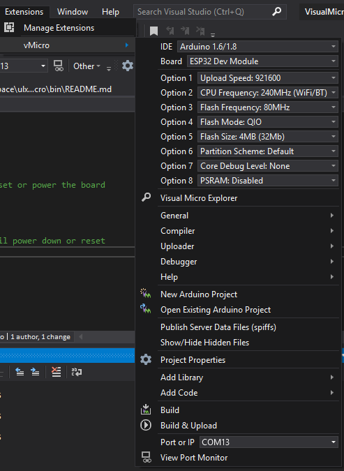

# Using Visual Micro to program the ULX3S ESP32

Similar to the [Arduino Blinky for the ESP32](../blinky/ESP32) using the [Arduino IDE](https://www.arduino.cc/en/Main/Software), this example uses the [Visual Micro](https://www.visualmicro.com/) IDE for [Visual Studio](https://visualstudio.microsoft.com/).

[Download the Arduino IDE for Visual Studio and Atmel Studio](https://www.visualmicro.com/page/Arduino-Visual-Studio-Downloads.aspx)

or install the [Arduino IDE from the Visual Studio Marketplace](https://marketplace.visualstudio.com/items?itemName=VisualMicro.ArduinoIDEforVisualStudio)

Ensure the [FPGA pass-thru](../passthru/) code is loaded onto the FPGA, as the ESP32 sits behind the ECP5 FPGA chip:


## Quick Start FPGA passthru
See [bin/upload_passthru.sh](../bin/upload_passthru.sh) or  [bin/upload_passthru.bat](../bin/upload_passthru.bat)

## Windows commandline / DOS prompt
```
if NOT EXIST c:\workspace mkdir c:\workspace
git clone https://github.com/gojimmypi/ulx3s-examples.git c:\workspace\ulx3s-examples
c:
cd \workspace\ulx3s-examples\bin\
.\ujprog.exe passthru.bit
```

## WSL
There is still not native USB driver support in WSL, so we expect an error message such as:
```
ULX2S / ULX3S JTAG programmer v 3.0.92 (built Jun  1 2019 15:29:22)
Cannot find JTAG cable.
```
We can call the Windows version from the Linux prompt. Note that for some unknown reason, it needs to be called from the Windows file system and not the Linux one. (e.g. not `~/workspace/`). Symptoms of running the Windows executable from the WSL filesystem is that no output at all is returned from `ujprog.exe`.
```
mkdir -p /mnt/c/workspace/  # this is actually C:\workspace\ to Windows
git clone https://github.com/gojimmypi/ulx3s-examples.git /mnt/c/workspace/ulx3s-examples
cd /mnt/c/workspace/ulx3s-examples/bin/
# ./ujprog.exe -j FLASH passthru.bit # optionally write to flash
./ujprog.exe passthru.bit
```
Here are some key settings in Visual Micro:



See also: 
* [gojimmypi blog on Using Visual Micro to program the ULX3S ESP32]()
* https://radiona.org/ulx3s/
* [Hackaday - ULX3S: An open-source Lattice ECP5 FPGA PCB](https://hackaday.com/2019/01/14/ulx3s-an-open-source-lattice-ecp5-fpga-pcb/)
* [hackaday.io -  ULX3S powerful ECP5 board for open source FPGA](https://hackaday.io/project/159108-ulx3s-powerful-ecp5-board-for-open-source-fpga)
* [hackaday.io - Initial support for ScopeIO for ULX3S](https://hackaday.io/project/159108-ulx3s-powerful-ecp5-board-for-open-source-fpga/log/163222-initial-support-for-scopeio-for-ulx3s)
* [ULX3S gitter Lobby](https://gitter.im/ulx3s/Lobby)
* [ESP-IDF Programming Guide](https://docs.espressif.com/projects/esp-idf/en/latest/)
* [ULX3S Examples](https://github.com/emard/ulx3s-examples)
* [ULX3S binaries](https://github.com/emard/ulx3s-bin)
* [Radiona links](https://github.com/RadionaOrg/ulx3s-links/blob/master/README.md)
* [Windows ujprog command-line parameter issues](https://github.com/f32c/tools/issues/10)
* [Windows ujprog compile error: 'EOPNOTSUPP' undeclared](https://github.com/f32c/tools/issues/8)
