# Requirements

- Visual Studio 2017 or 2019 with nanoFramework extension
- Python
- [ULX3S](https://www.crowdsupply.com/radiona/ulx3s) (or any ESP32 WROOM device)

# Programming the ULX3S ESP32 using C# in Visual Studio

In order to program the ESP32 on the ULX3S, the [PassThru FPGA](../passthru/README.md) code needs to first be loaded. 
This is typically already installed on new boards, and may not be necessary. Try to connect to the ESP32 first.

Programming in C# will require the [nanoFramework Extension for Visual Studio 2019](https://marketplace.visualstudio.com/items?itemName=nanoframework.nanoFramework-VS2019-Extension)
or the [nanoFramework Extension for Visual Studio 2017](https://marketplace.visualstudio.com/items?itemName=vs-publisher-1470366.nanoFrameworkVS2017Extension); yes, they are different!

Next, if you want to compile the [nanoFramework](https://nanoframework.net/) itself, the Arduino IDE ensure that the Espressif SDK 1.0.1 or later is installed. For more details, see the [ESP32 Blinky for ULX3S](../blinky/ESP32/README.md)

# Quickstart C# on the ULX3S ESP32

In order to program C# on the ESP32, a special bootloader is needed.

See the [upload_firmware.bat](./upload_firmware.bat); this uploads the binaries in [./bin/](./bin/) to the ESP32.

You'll need to know the USB port of your ESP32:

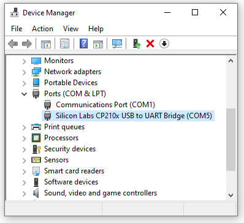

Example:

```
c:
if not exist c:\workspace mkdir c:\workspace
cd\workspace
git clone https://github.com/gojimmypi/ulx3s-examples.git

cd ulx3s-examples\

:: optionally switch to SSD1331 branch
git checkout SSD1331

cd nanoFramework

upload_firmware.bat COM5
```

If these binaries do not work, check the versions. The latest binaries can be downloaded from [here](https://github.com/nanoframework/nf-interpreter#firmware-for-reference-boards).
Note the files are not hosted on GitHub. Don't despair if there are no downloads available, click on the "Files" for a download. Might be nice to have the GitHub links go directly there.

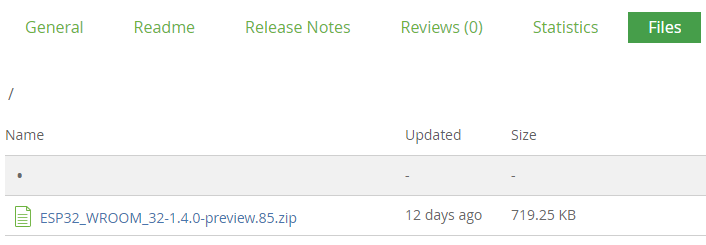


# Installing the nanoFramework Extension

The first thing to consider is if the nanoFramwork supports the ESP32 on the ULX3S. 
The documentation explicitly calls out the ESP32 DevKit-C. 
The ULX3S uses the ESP WROOM-32. 
The [Espressif docs indicates the DevKitC also uses the WROOM-32](https://www.espressif.com/en/products/hardware/esp32-devkitc/overview):

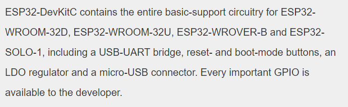

The easiest way to install the nanoFramework extension is from the Visual Studio `Extensions - Manage Extensions`:

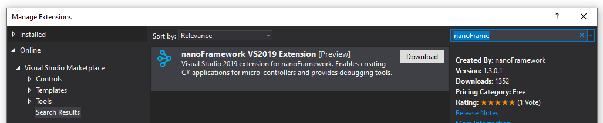


# Download nanoFramework packages

NuGet packages can be restored by clicking on the solution file and selecting `Restore NuGet Packages`

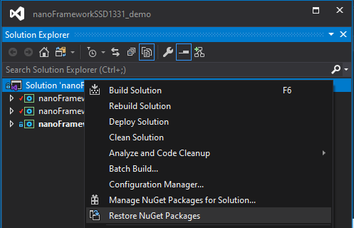

Packages can also be restored from the NuGet Manager commandline:

```
Update-Package -Reinstall -IncludePrerelease
```

Ensure the package source is set to `nuget.org`


See [Nuget package restore not working vs2019](https://github.com/NuGet/Home/issues/8852#issuecomment-579880577)

# Find ULX3S in Device Explorer

Key to uploading C#-compiled code, is ensuring Visual Studio can "see" the devices. Ensure the ULX3S is plugged into a USB port.
Click on `View - Other Windows - Device Explorer`. If the device is not listed, you may need to exist Visual Studio and try again.
The little refresh icon is for resetting; the magnifying glass is for refreshing the device list (searching device). When found, it should look something like this:
 
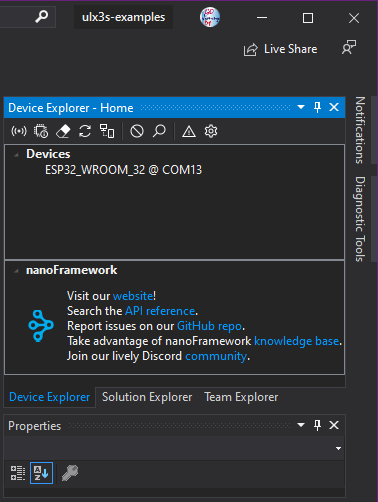

# Create a Project

There does not seem to be an easy way to browse to the project type:

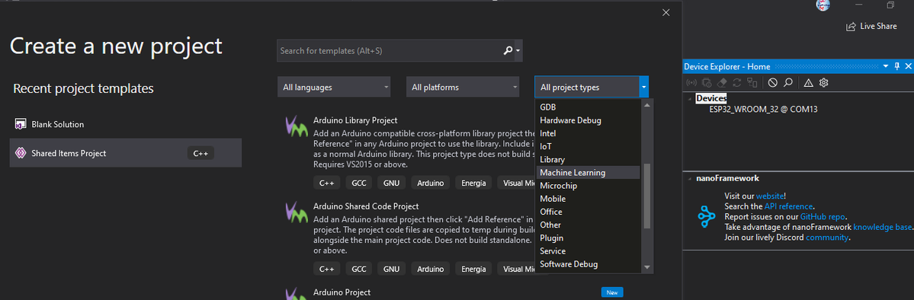

So you may need to search for it:

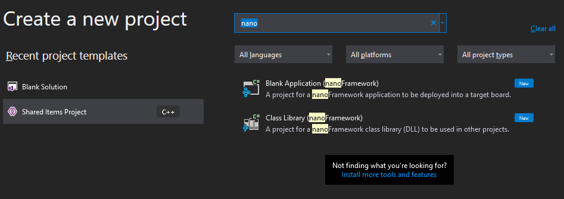

To blink the onboard LED, the `nanoFramework.Windows.Devices.Gpio` NuGet package reference is needed:

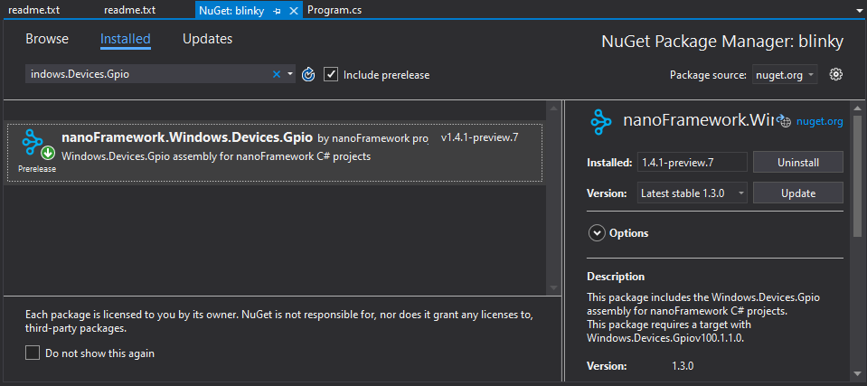

See also the online [source code for nanoFramework.Windows.Devices.Gpio](https://github.com/nanoframework/lib-Windows.Devices.Gpio). 

# Troubleshooting

## Debugger Doesn't step into main

Ensure the code with `main()` project is set as the startup project (right click)

## Object reference not set to an instance of an object at deployment time.

Ensure the device is selected in the Device Explorer Window

## Cannot find ESP32 in Device Explorer

Running multiple instances of Visual Studio can cause problems with device explorer. Close all running instances and try again.

## ImportError: No module named serial

If you see an error like this when attempting to flash the nanoFramework firmware:

```
Traceback (most recent call last):
  File "..\bin\ESP32\esptool.py", line 25, in <module>
    import serial
ImportError: No module named serial
```
See [Issue 350](https://github.com/espressif/esptool/issues/350) and try: 

```
pip install pyserial
```

This error typically means the wrong COM port was specified:
```
Traceback (most recent call last):
  File "..\bin\ESP32\esptool.py", line 2524, in <module>
    _main()
  File "..\bin\ESP32\esptool.py", line 2517, in _main
    main()
  File "..\bin\ESP32\esptool.py", line 2246, in main
    esp = chip_class(args.port, initial_baud)
  File "..\bin\ESP32\esptool.py", line 177, in __init__
    self._port = serial.serial_for_url(port)
  File "C:\Python27\lib\site-packages\serial\__init__.py", line 88, in serial_for_url
    instance.open()
  File "C:\Python27\lib\site-packages\serial\serialwin32.py", line 62, in open
    raise SerialException("could not open port {!r}: {!r}".format(self.portstr, ctypes.WinError()))
serial.serialutil.SerialException: could not open port 'COM5': WindowsError(2, 'The system cannot find the file specified.')
```

## error

```
1>------ Deploy started: Project: nanoFrameworkArduinoHelper, Configuration: Debug Any CPU ------
2>------ Deploy started: Project: nanoFrameworkSSD1331, Configuration: Debug Any CPU ------
2>Getting things ready to deploy assemblies to nanoFramework device: ESP32_WROOM_32 @ COM9.
2>nanoDevice is initialized
2>Deploy failed.
2>***************************************
2>Couldn't find a valid native assembly required by mscorlib v1.5.1.0, checksum 0xDCB6AEBA.
2>This project is referencing mscorlib NuGet package requiring native v100.4.5.0.
2>The connected target does not have support for mscorlib.
2>Please check: 
2>  1) if the target is running the most updated image.
2>  2) if the target image was built to include support for all referenced assemblies.
2>
2>If you are using PREVIEW versions of the NuGet packages, make sure you have our Azure Pipelines feed setup.
2>See here for details: https://nanoframework.net/2018/05/16/setup-visual-studio-to-access-preview-versions-feed
2>
2>***************************************
========== Build: 0 succeeded, 0 failed, 2 up-to-date, 0 skipped ==========
========== Deploy: 1 succeeded, 1 failed, 0 skipped ==========
```

## GenerateBinaryOutputTask task failed unexpectedly. The process cannot access the file

This error:
```
Severity	Code	Description	Project	File	Line	Suppression State
Error	MSB4018	The "GenerateBinaryOutputTask" task failed unexpectedly.
System.IO.IOException: The process cannot access the file 'C:\workspace\ulx3s-examples\nanoFramework\nanoFrameworkSSD1331\bin\Debug\nanoFrameworkSSD1331.dll' because it is being used by another process.
...etc
```
Try simmply building the project again (not rebuild)

## Package already exists in folder, Install failed. Rolling back...

If when attempting to update package dependencies, it is best to first update the core library. While performing and upgrade,
an error sometimes occurs where the package already exists:


```
Attempting to gather dependency information for package 'nanoFramework.CoreLibrary.1.6.0-preview.1' with respect to project 'nanoFrameworkSSD1331_demo', targeting '.NETnanoFramework,Version=v1.0'
Gathering dependency information took 40.75 ms
Attempting to resolve dependencies for package 'nanoFramework.CoreLibrary.1.6.0-preview.1' with DependencyBehavior 'Lowest'
Resolving dependency information took 0 ms
Resolving actions to install package 'nanoFramework.CoreLibrary.1.6.0-preview.1'
Resolved actions to install package 'nanoFramework.CoreLibrary.1.6.0-preview.1'
Removed package 'nanoFramework.CoreLibrary.1.5.1-preview.1' from 'packages.config'
Successfully uninstalled 'nanoFramework.CoreLibrary.1.5.1-preview.1' from nanoFrameworkSSD1331_demo
Package 'nanoFramework.CoreLibrary.1.6.0-preview.1' already exists in folder 'C:\workspace\nanoFramework\nanoFrameworkSSD1331_demo\packages'
Install failed. Rolling back...
Package 'nanoFramework.CoreLibrary.1.6.0-preview.1' does not exist in project 'nanoFrameworkSSD1331_demo'
Package 'nanoFramework.CoreLibrary.1.5.1-preview.1' already exists in folder 'C:\workspace\nanoFramework\nanoFrameworkSSD1331_demo\packages'
Added package 'nanoFramework.CoreLibrary.1.5.1-preview.1' to 'packages.config'
Executing nuget actions took 3.68 sec
Failed to add reference to 'mscorlib'.
  Could not load file or assembly 'mscorlib.dll' or one of its dependencies. The system cannot find the file specified.
  The system cannot find the file specified. (Exception from HRESULT: 0x80070002)
Time Elapsed: 00:00:04.1863170
========== Finished ==========
```

This first step is to simply manually delete that tpackage directory and try again. If that does not work, press this button to upgrade, and wait for next dialog:

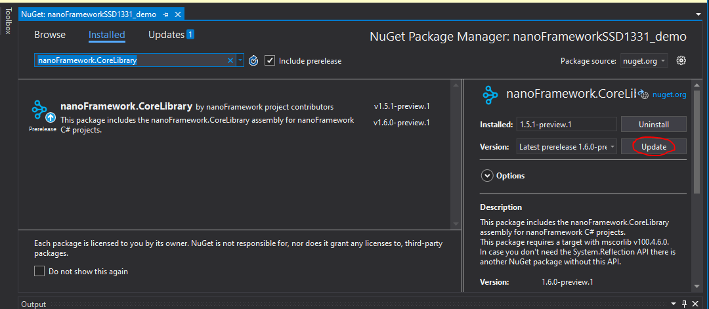

When this dialog is displayed:

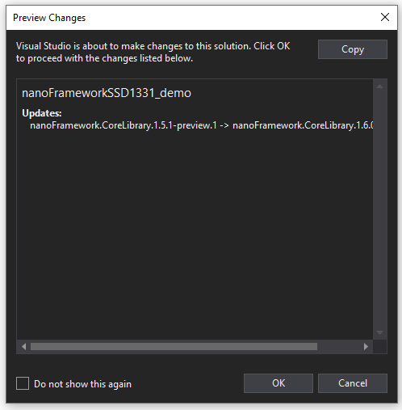

Note the output window:

```
Attempting to gather dependency information for package 'nanoFramework.CoreLibrary.1.6.0-preview.1' with respect to project 'nanoFrameworkSSD1331_demo', targeting '.NETnanoFramework,Version=v1.0'
Gathering dependency information took 7.25 ms
Attempting to resolve dependencies for package 'nanoFramework.CoreLibrary.1.6.0-preview.1' with DependencyBehavior 'Lowest'
Resolving dependency information took 0 ms
Resolving actions to install package 'nanoFramework.CoreLibrary.1.6.0-preview.1'
Resolved actions to install package 'nanoFramework.CoreLibrary.1.6.0-preview.1'
```

While the dialog box above is diplayed, go to the `C:\workspace\nanoFramework\nanoFrameworkSSD1331_demo\packages` and manually delete the
library that is being upgraded (in this case `nanoFramework.CoreLibrary.1.5.1-preview.1` and `nanoFramework.CoreLibrary.1.6.0-preview.1`)

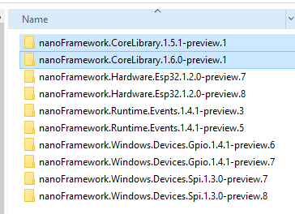

After the direcctories) are deleted, then press the ok button the `Preview Changes` dialog box. 
A successful update should look something like this:

```
Attempting to gather dependency information for package 'nanoFramework.CoreLibrary.1.6.0-preview.1' with respect to project 'nanoFrameworkSSD1331_demo', targeting '.NETnanoFramework,Version=v1.0'
Gathering dependency information took 3.02 ms
Attempting to resolve dependencies for package 'nanoFramework.CoreLibrary.1.6.0-preview.1' with DependencyBehavior 'Lowest'
Resolving dependency information took 0 ms
Resolving actions to install package 'nanoFramework.CoreLibrary.1.6.0-preview.1'
Resolved actions to install package 'nanoFramework.CoreLibrary.1.6.0-preview.1'
Package 'nanoFramework.CoreLibrary.1.5.1-preview.1' does not exist in folder 'nanoFrameworkSSD1331_demo'
Successfully uninstalled 'nanoFramework.CoreLibrary.1.5.1-preview.1' from nanoFrameworkSSD1331_demo
Adding package 'nanoFramework.CoreLibrary.1.6.0-preview.1' to folder 'C:\workspace\nanoFramework\nanoFrameworkSSD1331_demo\packages'
Added package 'nanoFramework.CoreLibrary.1.6.0-preview.1' to folder 'C:\workspace\nanoFramework\nanoFrameworkSSD1331_demo\packages'
Added package 'nanoFramework.CoreLibrary.1.6.0-preview.1' to 'packages.config'
Successfully installed 'nanoFramework.CoreLibrary 1.6.0-preview.1' to nanoFrameworkSSD1331_demo
Executing nuget actions took 960.98 ms
Time Elapsed: 00:00:01.0133381
========== Finished ==========
```


if you see an error like "Couldn't find a valid native assembly required by mscorlib v1.3.0.3":


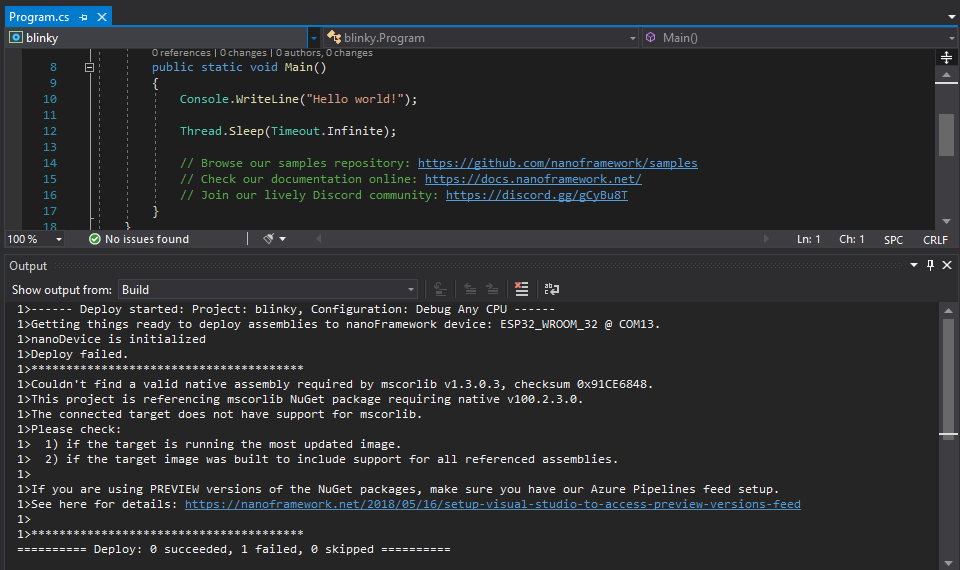

Ensure the Core Library checkbox is checked in `Tools - NuGet Package Manager - Manage NuGet Packages for Solution`

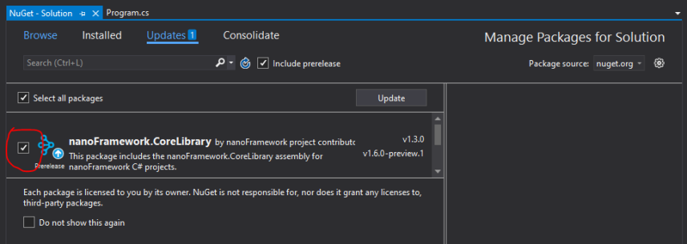

## A fatal error occurred: Failed to connect to ESP32: Timed out waiting for packet header


When flashing the nanoFramework bootloader, the esptool may fail. 
Although this occurs on some other ESP32 boards, it typically is not an issue on the ULX3S.

Attempting to upload gives a sequence of dots and underlines, then gives up:

```
Connecting........_____....._____....._____.....
```

This is a common message for some ESP32 boards that did not implement a robust auto-detect of the uploader. 
Some manual intervention is needed to kickstart the upload. 

While running uploader: Hold down `1O0`, continue holding then press `EN`, release `EN` amd release `IO0` and the upload should begin.

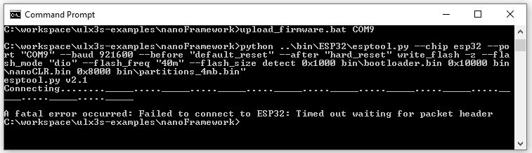

This process may need to be repeated. To experiment interactively, connect a terminal program such as putty to the COM port:

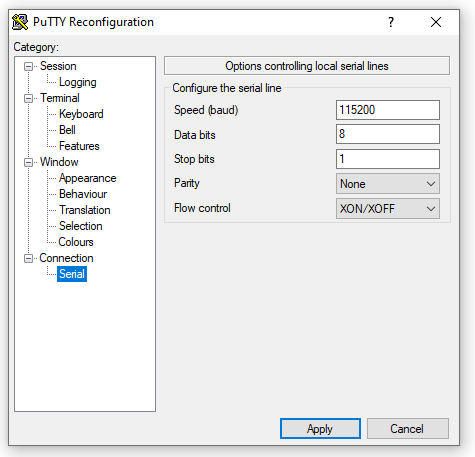

Observe the sequence of button presses to get this prompt:

```
ets Jun  8 2016 00:22:57

rst:0x1 (POWERON_RESET),boot:0x3 (DOWNLOAD_BOOT(UART0/UART1/SDIO_REI_REO_V2))
waiting for download

```

Be sure to lose the putty application as the nanoFramework needs exclusive access to the COM port.

## A fatal error occurred: Invalid head of packet ('e')

Although this occurs on other ESP32 boards, it typically is not an issue on the ULX3S.

This error is also typical of some ESP32 boards needing the special button sequence. Often this message will be seen after the nanoFramework
has been successfully loaded onto the chip.

While running uploader: Hold down `1O0`, continue holding then press `EN`, release `EN` amd release `IO0` and the upload should begin.

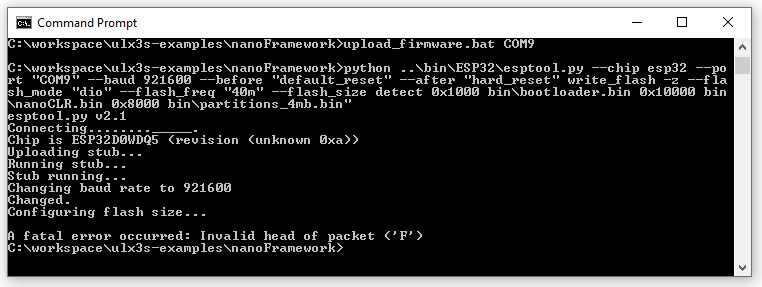

# Building the nanoFramework bootloader.

See the [source code](https://github.com/nanoframework/nf-interpreter/tree/develop/targets/FreeRTOS_ESP32/ESP32_WROOM_32).


# Links:

https://nanoframework.net/

https://www.espressif.com/en/products/hardware/esp32-devkitc/overview

https://en.wikipedia.org/wiki/ESP32#Programming

https://github.com/nanoframework/nf-Visual-Studio-extension

https://marketplace.visualstudio.com/items?itemName=nanoframework.nanoFramework-VS2019-Extension

https://nanoframework.net/home/getting-started-guides/

http://docs.nanoframework.net/content/getting-started-guides/getting-started-managed.html

https://nanoframework.net/2018/05/16/setup-visual-studio-to-access-preview-versions-feed/

http://docs.nanoframework.net/content/getting-started-guides/build-esp32.html#notes-on-jtag-debugging-on-esp32

https://bintray.com/nfbot/nanoframework-images-dev/

https://bintray.com/nfbot/nanoframework-images-dev/ESP32_WROOM_32/1.4.0-preview.85#files

https://github.com/nanoframework/nf-interpreter#firmware-for-reference-boards


https://github.com/emard/ulx3s/issues/8

https://github.com/adafruit/Adafruit-SSD1331-OLED-Driver-Library-for-Arduino/blob/master/Adafruit_SSD1331.cpp

https://github.com/nanoframework/lib-Windows.Devices.Gpio

https://www.electronics-lab.com/project/color-oled-ssd1331-display-arduino-uno/

https://github.com/Dweaver309/nanoframework.SS1306

https://github.com/NuGet/docs.microsoft.com-nuget/blob/master/docs/what-is-nuget.md

https://github.com/nanoframework/lib-Windows.Devices.Spi/tree/develop/source/Windows.Devices.Spi

https://docs.nanoframework.net/api/Windows.Devices.Spi.html

https://discordapp.com/channels/478725473862549535/532862286797471744

https://github.com/sumotoy/SSD_13XX