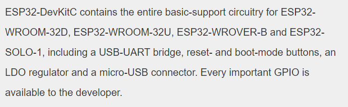

# Programming the ULX3S ESP32 using C# in Visual Studio

In order to program the ESP32 on the ULX3S, the [PassThru FPGA](../passthru/README.md) code needs to first be loaded.

Programming in C# will require the [nanoFramework Extension for Visual Studio 2019](https://marketplace.visualstudio.com/items?itemName=nanoframework.nanoFramework-VS2019-Extension)
or the [nanoFramework Extension for Visual Studio 2017](https://marketplace.visualstudio.com/items?itemName=vs-publisher-1470366.nanoFrameworkVS2017Extension); yes, they are different!

Next, if you want to compile the [nanoFramework](https://nanoframework.net/) itself, the Arduino IDE ensure that the Espressif SDK 1.0.1 or later is installed. For more details, see the [ESP32 Blinky for ULX3S](../../blinky/ESP32/README.md)

# Quickstart C# on the ULX3S ESP32

In order to propgram C# on the ESP32, a special bootloader is needed.

See the [upload_firmware.bat](./upload_firmware.bat); this uploads the binaries in [./bin/] to the ESP32.

If these binaries do not work, check the versions. The latest binaries can be downloaded from [here](https://github.com/nanoframework/nf-interpreter#firmware-for-reference-boards).
Note the files are not hosted on GitHub. Don't despair if there are no downloads available, click on the "Files" for a download. Might be nice to have the GitHub links go directly there.

# Installing the nanoFramework.

The first thing to consider is if the nanoFramwork supports the ESP32 on the ULX3S. 
The documentation explicitly calls out the ESP32 DevKit-C. 
The ULX3S uses the ESP WROOM-32. 
The [Espressif docs indicates the DevKitC also uses the WROOM-32](https://www.espressif.com/en/products/hardware/esp32-devkitc/overview):

# Find ULX3S in Device Explorer

Key to uploading code, is ensuring Visual Studio can "see" the devices. Ensure the ULX3S is plugged into a USB port.
Click on `View - Other Windows - Device Explorer`. If the device is not listed, you may need to exist Visual Studio and try again.
There does not appear to be a "device refresh / rescan" feature. When found, it should look something like this:
 

# Create a Project

There does not seem to be an easy way to browse to the project type:

So you may need to search for it:

# Troubleshooting

if you see an error like "Couldn't find a valid native assembly required by mscorlib v1.3.0.3":

Ensure the Core Library checkbox is checked:

# Building the nanoFramework bootloader.

See the [source code](https://github.com/nanoframework/nf-interpreter/tree/develop/targets/FreeRTOS_ESP32/ESP32_WROOM_32).

Links:

https://nanoframework.net/

https://www.espressif.com/en/products/hardware/esp32-devkitc/overview

https://en.wikipedia.org/wiki/ESP32#Programming

https://github.com/nanoframework/nf-Visual-Studio-extension

https://marketplace.visualstudio.com/items?itemName=nanoframework.nanoFramework-VS2019-Extension

https://nanoframework.net/home/getting-started-guides/

http://docs.nanoframework.net/content/getting-started-guides/getting-started-managed.html

https://nanoframework.net/2018/05/16/setup-visual-studio-to-access-preview-versions-feed/

http://docs.nanoframework.net/content/getting-started-guides/build-esp32.html#notes-on-jtag-debugging-on-esp32

https://bintray.com/nfbot/nanoframework-images-dev/

https://bintray.com/nfbot/nanoframework-images-dev/ESP32_WROOM_32/1.4.0-preview.85#files

https://github.com/nanoframework/nf-interpreter#firmware-for-reference-boards

